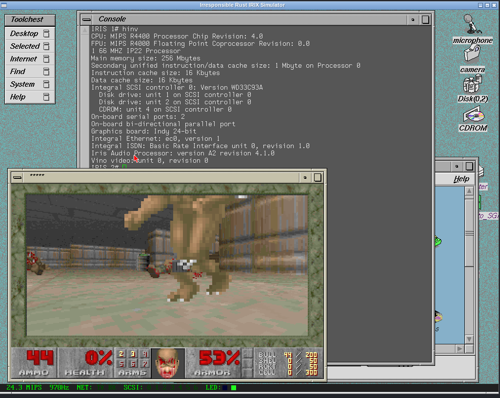

Me and my homies Claude and Gemini present:


# IRIS — Irresponsible Rust IRIX Simulator

An SGI Indy emulator, vibed into existence with Rust and AI assistance.
Boots IRIX 6.5 and 5.3. Has networking. Has a framebuffer.




## Q&A

**Q: What is it?**
An SGI Indy (MIPS R4400) emulator. Emulates enough of the hardware that IRIX
actually boots to a usable system — shell, networking, X11, the works.

**Q: But why?**
Wanted to see how far vibe coding could go, and to learn some Rust along the way.

**Q: You could have improved MAME.**
Didn't seem like fun.

**Q: So did you learn Rust?**
LOL, my brain hurts. Let's not get ahead of ourselves.

**Q: What LLMs did you use?**
Mostly Claude, some Gemini. They wrote a lot of the hard parts. (This was written by Claude, the humble AI assistant).

**Q: Can I contribute?**
Yes, bug reports and merge requests are welcome.

**Q: Regrets?**
Yes.


## Current status

- IRIX 6.5 boots to multiuser, networking works (ping, telnet, ftp)
- IRIX 5.3 works too
- X11 / Newport (REX3) graphics works
- Old Gentoo-mips livecd-mips3-gcc4-X-RC6.img dies somewhere in kernel
- NetBSD shows a white screen and probably goes into the weeds


## Getting started

You need:
- `scsi1.raw` — raw hard disk image with IRIX 6.5.22 for Indy
for a quick start get the mame irix image from https://mirror.rqsall.com/sgi-mame/ and convert to raw using chdman extractraw
- `070-9101-011.bin` — Indy PROM image (optional; a default is embedded)

```
cargo run --release
you can add --features lightning for a little more speed
```

See [HELP.md](HELP.md) for the full rundown — serial ports, monitor console,
NVRAM/MAC address setup, disk image prep, and more.


## License

BSD 3-Clause

## Whodunnit?

Dominik Behr
